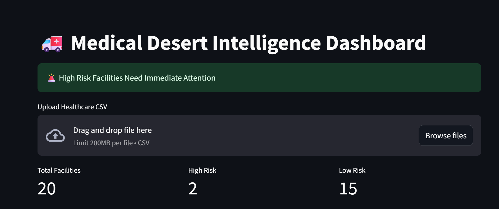
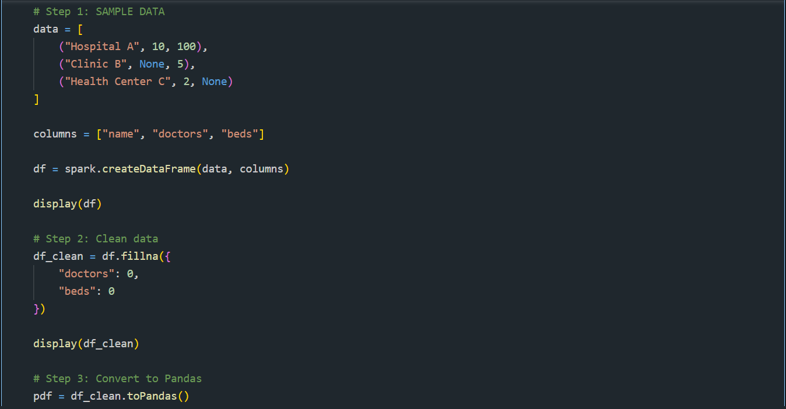
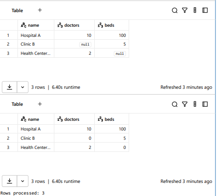

# 🚑 Medical Desert Intelligence Agent

## 🌍 Overview

This project is an AI-powered system that identifies healthcare gaps (medical deserts) by analyzing unstructured facility data.

It extracts meaningful medical capabilities, detects unreliable claims, and provides actionable insights for NGOs and healthcare planners.

---

## ⚙️ Features

* 🔍 Intelligent Document Parsing (IDP)
* 🚨 Medical Desert Detection (Risk Scoring)
* ⚠️ Suspicious Claim Detection
* 📄 Evidence-backed Insights (Citations)
* 📊 Interactive Dashboard (Streamlit)
* 🗺️ Geographic Visualization (Map)
* 🎯 Actionable Recommendations for NGOs

---

## 🧠 Tech Stack

* Python
* Streamlit
* Pandas
* Plotly
* Databricks (Apache Spark)
* MLflow (Experiment Tracking)

---

## ⚡ Databricks Usage

We used Databricks to simulate scalable healthcare data processing using Apache Spark.

* Data ingestion using Spark
* Handling missing values (data cleaning)
* Converting to structured format for AI processing
* MLflow used for tracking metrics such as processed rows and missing values

---

## 🚀 How to Run

```bash
pip install -r requirements.txt
streamlit run app.py
```

---

## 📊 Demo Flow

1. Upload healthcare dataset
2. Run AI agent
3. View:

   * Risk ranking
   * Top critical facilities
   * Suspicious claims
   * Planner recommendations
   * Map visualization

---

## 📸 Screenshots

### 🔹 Streamlit Dashboard



### 🔹 Databricks Processing





---

## 🎯 Impact

This system helps:

* Identify underserved healthcare regions
* Improve decision-making for NGOs
* Reduce delays in patient care

---

## 🧑‍💻 Author

Shikhar Pandey
